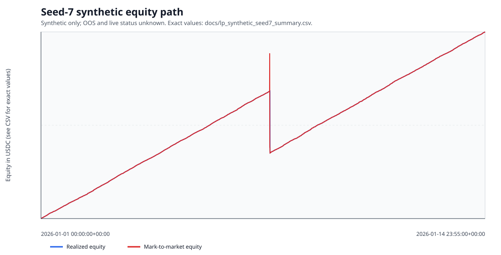

# Polymarket LP Research Toolkit

A Python simulator and paper-research toolkit for testing risk-gated Polymarket liquidity-provision hypotheses without placing live orders.

## Status & honesty

- Status: active synthetic and paper-research scaffold; live orders are intentionally unsupported.
- Headline result ? **SYNTHETIC (seed 7)**: `total_pnl_usdc = 122.63378371068302`; **SYNTHETIC (seed 7)**: `pair_completion_ratio_shares = 0.0 (0%)`. Source: `docs/lp_synthetic_seed7_summary.csv:2`.
- **SYNTHETIC (seed 7)**: `total_reward_usdc = 163.42548863585822`, `total_inventory_exit_pnl_usdc = -40.79170492517545`, and `max_drawdown_mtm_usdc = -65.50954640844861`. Source: `docs/lp_synthetic_seed7_summary.csv:2`.
- In-sample/out-of-sample classification: UNKNOWN. Live fills, cancellations, reward payouts, execution latency, and profitability: UNKNOWN.
- License file: UNKNOWN (no `LICENSE` file is present). Project metadata declares MIT in `pyproject.toml`; no standalone license is added here.

## Architecture

- `polymarket_lp/lp_backtest.py` loads point-in-time snapshots, constructs paired YES/NO quotes, tracks inventory lots, and simulates fills, pairing, exits, rewards, and mark-to-market equity.
- Risk controls cap simultaneous one-sided exposure at market, cluster, and portfolio levels before reward scoring.
- `polymarket_lp/paper.py` creates read-only paper quotes from public snapshots; it neither signs, submits, nor cancels orders.
- Governance modules evaluate candidate, capital-risk, drawdown, depth, lifecycle, and reward-reconciliation gates from recorded artifacts.
- `scripts/lp_backtest.py` is the executable synthetic/snapshot backtest entry point; CI runs its synthetic smoke path.

## The interesting decision

Quotes are ranked by reward density subject to bounded unpaired-inventory risk rather than by gross reward alone. The tradeoff is explicit: the positive **SYNTHETIC (seed 7)** PnL above coexists with **SYNTHETIC (seed 7)** `pair_completion_ratio_shares = 0.0 (0%)`, so it is not evidence that the strategy can complete pairs or earn live rewards.

## Provenance

- The committed unrounded summary is `docs/lp_synthetic_seed7_summary.csv:2`; `docs/RESULTS.md` records its deterministic rerun hash and states that its IS/OOS classification is UNKNOWN.
- The chart below is the committed synthetic equity artifact `docs/lp_synthetic_seed7_equity.svg`. Its embedded description identifies the README synthetic command as its generation procedure; no live market data is represented.
- Synthetic generator defaults are implemented in `polymarket_lp/lp_backtest.py:make_synthetic_snapshots`; the exact benchmark parameters are in the command below.



## Run it

```bash
uv sync --all-extras --locked
uv run ruff check .
uv run ruff format --check .
uv run mypy
uv run pytest -q
uv run python scripts/lp_backtest.py --synthetic --seed 7 --synthetic-days 14 --synthetic-markets 30 --quote-size 800 --quote-offset 0.035 --excluded-categories "" --active-capital-limit 1900 --max-unpaired-per-market 800 --max-total-unpaired 1200 --max-cluster-unpaired 600 --exit-loss-cents 0.05 --max-unpaired-minutes 90 --max-recent-vol 0.006 --max-recent-jump 0.025 --vol-quote-multiplier 0.5 --out-dir data/processed/income_density_wide
```

For a snapshot replay, provide a point-in-time CSV with the required columns documented in `docs/PAPER_RUN_AND_BACKTEST.md` and run `uv run python scripts/lp_backtest.py --snapshots <path> --out-dir <path>`.

## Limitations

- The reported values are **SYNTHETIC (seed 7)** only, not live or out-of-sample evidence.
- Fill behavior is simulated; it does not establish queue position, adverse selection, spread capture, fees, latency, or reward eligibility in a live venue.
- Paper diagnostics are next-snapshot midpoint-cross proxies, not executed-order proof.
- A result with `pair_completion_ratio_shares = 0.0 (0%)` requires stronger real-snapshot and out-of-sample evidence before any trading claim.
